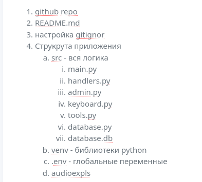

## Структура приложения

## Функции

1. Создание субтитров - нейросеть (captions)

2. Генерация видео 

3. Создание виатории на основе видео

Упражнения на грамматику (по тексту)

Выделение ключевых фраз (конструкций речи)

Составление упражнения по теме - подключить анализатор текстов chat gpt

Генерация видео для уроков произношения